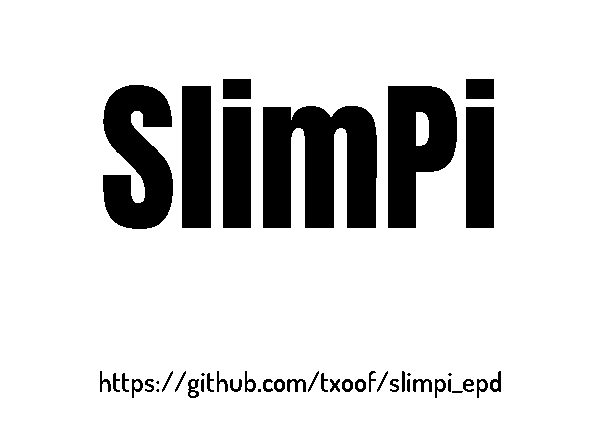

# SlimPi - ePaper based Logitech Media Player Display


SlimPi provides a Logitech Media Player display using a [WaveShare e-Paper display](https://www.waveshare.com/product/oleds-lcds/e-paper.htm) and a Raspberry Pi.

***Include an image of the finished project here***

## Features
SlimPi provides a *now playing* display for a selected Logitech Media Player. When the player is paused, an alternative screen is displayed.

The default configuration shows the following information:

</img>

* Track Title
* Artist Name
* Album Name
* Album Artwork (if available)
* Now Playing Mode: e.g. play, stop, pause

When the music is paused, the display shows an alternative screen.

**Word Clock** (default)


**Clock**


The refresh rate of HAT compatable waveshare displays is relatively slow (5-20 seconds) and does not support partial refreshes. This results in the display pulsing between an all-white and all-black state several times during each refresh. 

To limit the visual disturbance of a pulsing screen, the default refresh for the Word Clock is 295 seconds (just under 5 minutes). This can be adjusted in the configuration file.


## Quick Install
1. Download the installable package from [git hub](https://github.com/txoof/slimpi_epd/raw/master/slimpi_latest.tgz)
2. Decompress the tarball: `tar xvzf slimpi_latest.tgz`
3. Run the installer: 
   * `install.sh` for a daemon that starts automatically at boot, or see below for running in user space
   * `user_install.sh` to setup the configuration files
4. Edit the appropriate configuation file `/etc/slimpi.cfg` for daemon or `~/.config/com.txoof.slimpi/slimpi.cfg` for user space
    * Required settings that must be set:
        - `display = waveShareEPDType`
        - example: `display = epd5in83`
            * The display type should match the model number of your e-Paper display
        - `player_name = "Name Of LMS Player on Local Network"` 
        - example: `player_name = slimpi`
            * The player name can be found by running `slimpi --list-servers`:
            
            
        ```
        slimpi --list-servers

        Scanning for available LMS Server and players
        servers found:
        [{'host': '192.168.178.9', 'port': 9000}]

        players found:
        name: Chilab'le <---player_name
        playerid: 00:04:20:07:e6:44
        modelname: Squeezebox Classic


        players found:
        name: slimpi <---player_name
        playerid: dc:a6:32:29:99:f0
        modelname: SqueezeLite   
        ```

## Requirements
### Required Hardware
* Raspberry Pi 4 Model B
    * RPI 3 Model A should work as well, but is untested
* [WaveShare e-Paper display with e-Paper HAT](https://www.waveshare.com/product/oleds-lcds/e-paper.htm)
    * Any waveshare display should work -- see [Supported WaveShare ePaper Displays](#supported-waveshare-epaper- displays)

### Optional Hardware
* [HiFiBerry hat](https://www.hifiberry.com/shop/#boards) (*optional*) 
    * The HiFiBerry DAC+ PRO and similar boards add high-quality audio output to the Pi so it can act as a display and also work as a LMS client player using squeezelite
    * GPIO 2x20 headers **must be added** to the board to support WaveShare HAT
    * HiFiBerry's [DAC+ Bundle](https://www.hifiberry.com/shop/bundles/hifiberry-dac-bundle-4/) with the following configuraiton is a good choice:
        * DAC+ Pro 
        * Acrylic Case for (RCA) AND DIGI+
        * Raspberry Pi 4B 2GB (1GB should be sufficient as well)
        * 16GB SD Card
        * PowerSupply (USB C 5.1V/3A)
        * 2x20 Pin Male Header (required for WaveShare HAT)
    
### Required Software
* [Logitech Media Server](http://wiki.slimdevices.com/index.php/Logitech_Media_Server) running on local network
    * An LMS instance can be run on the Raspberry Pi - [Home Hack - Creating a Raspberry Pi Squeezebox server](https://homehack.nl/creating-a-raspberry-pi-squeezebox-server/) 

### Opational Software
* [squeezelite](http://wiki.slimdevices.com/index.php/Squeezelite) *(optional)*
    * Squeezelite, in combination with a HiFiBerry, allows the Pi to be usded as LMS client player

## System Setup
SlimPi requries that SPI is enabled on the Raspberry Pi.
* Enable SPI
    * `sudo raspi-config` Interfacing Options > SPI > Would you Like the SPI interface to be enabled > Yes

### Configure HiFiBerry *(optional)*
A HiFiBerry DAC+ or similar can be used for audio output. HiFiBerry has a [great guide for configuring Linux 4 kernels](https://www.hifiberry.com/docs/software/configuring-linux-3-18-x/)

The quick and dirty version can be found below
1. Disable onboard sound in `/boot/config.txt` 
    * `#dtparam=audio=on`
2. Load deviced tree overlay for HiFiBerry in `/boot/config.txt`
    * `dtoverlay=hifiberry-dacplus`
3. Configure ALSA output *(optional)*
    * Check that there is not a conflicing `.asound.conf` file in `~/`
    * Create `/etc/asound.conf` and include the following:
    ```
    pcm.!default {
    type hw card 0
    }
    ctl.!default {
    type hw card 0
    }
    ```
    
### Install and Configure Squeeze Lite *(optional)*
Squeezelite is a light-weight headless Squeezebox LMS player that works well with a HiFiBerry.

* Install squeezelite package: `$ sudo apt-get install squeezelite`
* Squeezelite uses the hostname as its default name to change the name do one of the following:
    * Change the hostname:
        1. `$ raspi-config` Network Options > Hostname
        2. Edit `/etc/default/squeezelite` and edit `SL_NAME=YOUR_NAME_HERE`
    * Additional squeezelite arguments such as resampling rates can be passed here as well - for a complete list see `$man squeezelite`

## Software Configuration
### Configuration Files
The SlimPi configuration is managed through the following three files which are loaded sequentially each superceeding the previous files. 

1. `./slimpi/slimpi.cfg` Basic default configuration file; this should not be edited
2. `/etc/slimpi.cfg` System-wide configuration file; this can be used to set any system-wide default settings
3. `~/.config/com.txoof.slimpi/slimpi.cfg` User level configuration file; this will be ignored when running as a daemon 
    * Required settings that must be configured in either `/etc/slimpi.cfg` or `~/.config/com.txoof.slimpi/slimpi.cfg`:
        - `display = waveShareEPDType`
        - example: `display = epd5in83`
            * The display type should match the model number of your e-Paper display
        - `player_name = "Name Of LMS Player on Local Network"` 
        - example: `player_name = slimpi`
            * The player name can be found by running `slimpi --list-servers`:
            
        ```
        slimpi --list-servers

        Scanning for available LMS Server and players
        servers found:
        [{'host': '192.168.178.9', 'port': 9000}]

        players found:
        name: Chilab'le <---player_name
        playerid: 00:04:20:07:e6:44
        modelname: Squeezebox Classic


        players found:
        name: slimpi <---player_name
        playerid: dc:a6:32:29:99:f0
        modelname: SqueezeLite   
        ```

### Configure as a System Process
SlimPi can run as a system process that starts at boot and runs in the background. 

1. Download and decompress [`slimpi_latest.tgz`](https://github.com/txoof/slimpi_epd/raw/master/slimpi_latest.tgz)
2. Run the included `install.sh` script
    * This script will attempt to install slimpi as a daemon process that starts at boot
        * `sudo install.sh`
3. Configure slimpi for your Logitech Media Server and e-Paper display
    * Set `player_name = ` and `display = ` settings in /etc/slimpi.cfg (see [Configuration Files](# Configuration_Files) above

### Configure HiFiBerry *(optional)*
A HiFiBerry DAC+ or similar can be used for audio output. HiFiBerry has a [great guide for configuring Linux 4 kernels](https://www.hifiberry.com/docs/software/configuring-linux-3-18-x/)

The quick and dirty version can be found below
1. Disable onboard sound in `/boot/config.txt` 
    * `#dtparam=audio=on`
2. Load deviced tree overlay for HiFiBerry in `/boot/config.txt`
    * `dtoverlay=hifiberry-dacplus`
3. Configure ALSA output *(optional)*
    * Check that there is not a conflicing `.asound.conf` file in `~/`
    * Create `/etc/asound.conf` and include the following:
    ```
    pcm.!default {
    type hw card 0
    }
    ctl.!default {
    type hw card 0
    }
    ```
    
### Install and Configure Squeeze Lite *(optional)*
Squeezelite is a light-weight headless Squeezebox LMS player that works well with a HiFiBerry.

* Install squeezelite package: `$ sudo apt-get install squeezelite`
* Squeezelite uses the hostname as its default name to change the name do one of the following:
    * Change the hostname:
        1. `$ raspi-config` Network Options > Hostname
        2. Edit `/etc/default/squeezelite` and edit `SL_NAME=YOUR_NAME_HERE`
    * Additional squeezelite arguments such as resampling rates can be passed here as well - for a complete list see `$man squeezelite`

## Setup Python Environment for Building
To build an executable package suitable for installing SlimPi requires several Debian development packages as well as several python libraries. See below for specifics.

### Quick and Dirty Build
The `build.sh` script will attempt to check the build environment and suggest any missing Debian packages. The next step is to build a virtualenv using pipenv. The final step is to create an executable package using pyinstaller. See below for more detailed requirements.
-  run: `./build.sh`

### Build Requirements
- System Software
    * python3 
        `apt-get install python3`
    * pip
        `apt-get install python3-pip`
    * pipevn
        - `pip3 install pipenv`
    * RPi.GPIO python libraries - pipenv chokes on the '.' characters in the name
        - `pip3 install RPi.GPIO`
- System Libraries
    * `libtiff5-dev, libopenjp2-7-dev`
        * install with `sudo apt-get install libtiff5-dev libopenjp2-7-dev`
- Python Libraires from PyPi:
    * `Pillow, cachepath, ratelimiter, lmsquery-fork, spidev`
    *  Install with pipenv:
        - `pipenv --three; pipenv sync` 
            - This will create a virtual environment and install the appropriate packages and dependencies        
            - NOTE: `RPi.GPIO` must be added to Pipfile by and and quotated: `"RPi.GPIO" = "*" `

### Building SlimPi
- Create a runnable package using PyInstaller
    * PyInstaller must be run within the virtual environment:
        * `pipenv run pyinstaller --clean 

## Screen Layouts
Layouts determine what content is displayed and where on the screen. The layouts are stored in `slimpi/layouts.py`. Layouts are designed to work on any sized screen as they will adapt to the number of pixels available. 

Any of the following information can be displayed on the "Now Playing" screen of slimpi. 
```
'field name': 'Data'
====================

'id': 52005,
'title': "Women's Realm",
'artist': 'Belle and Sebastian',
'coverid': 'd9b0a026',
'duration': 275.513,
'album_id': '5008',
'genre': 'No Genre',
'album': 'Fold Your Hands Child, You Walk Like a Peasant',
'artwork_url': 'http://192.168.178.9:9000/music/d9b0a026/cover.jpg',
'time': 12.4120923690796,
'mode': 'play'
'coverart': '/tmp/com.txoof.slimpi/5008.jpg'
```

Layout element dimensions are calculated based on a single absolute coordinate and must be organized with the absolute coordinate first and then proceed with each logical sub element.

New layouts can be added to `slimpi/layouts.py` by following the examples below. 

Specify an alternative now playing layout in the configuartion file `now_playing = layout_name`.

Slimpi must be restarted for the changes to take effect (CTRL+C for user; `sudo systemd restart slimpi-daemon`)
```
# Simple Two Row display of track title and artist
twoRow = {
    'title':
        {'image': None,    # `None` for no image, `True` for an image block
         'max_lines': 3,   # integer - maximum number of lines of text this block can contain
         'padding': 10,    # integer - number of pixles to pad between edge of screen and text
         'width': 1,       # real - percentage of width to use for this block (1 = 100%)
         'height': 1/2,    # real - percentage of height to use for this block (1/2 = 50%)
         'abs_coordinates': (0, 0), # tuple of integer - top left coordinate for this block
         'hcenter': True,  # boolean - `True` to center text or image; `False` to left justify
         'vcenter': True,  # boolean - `True` to vertically center text or image; `False` to left justify
         'font': './fonts/Font/font-regular.ttf' # string for relative (or absolute) path to TTF font file
         'font_size': None} # None/integer - None to calculate the font size based on screen size
   'artist':
       {'image: None,
        'max_lines': 2,
        'padding': 10,
        'width': 1,
        'height': 1/2,
        'abs_coordinates': (0, None), # use an X value of 0 (left side of screen), None indicates that the Y will be calculated 
        'relative': ['artist', 'title'] # use the absolute X from 'artist' section and calculated Y value from 'title'
        'hcenter': True,
        'vcenter': True,
        'font': ./font/Font/font-regular.ttf,
        'font_size': None}
}

# More complex three row layout with images multiple horizontal blocks
threeRow = {
    'title':
            {'image': None,
             'max_lines': 2,
             'padding': 10,
             'width': 1,
             'height': 4/7,
             'abs_coordinates': (0, 0),
             'hcenter': True,
             'vcenter': True,
             'relative': False,
             'font': './fonts/Anton/Anton-Regular.ttf',
             'font_size': None},
    'coverart':
            {'image': True,
             'max_lines': None,
             'padding': 2,
             'width': 2/5,
             'height': 3/7,
             'abs_coordinates': (0, None),
             'hcenter': True,
             'vcenter': True,
             'relative': ['coverart', 'title'], # use X=0 and Y=bottom of 'title'
             'font': './fonts/Anton/Anton-Regular.ttf',
             'font_size': None},

    'artist':
            {'image': None,
             'max_lines': 2,
             'padding': 10,
             'width': 3/5,
             'height': 3/14,
             'abs_coordinates': (None, None), # no absolute coordinates 
             'hcenter': False,
             'vcenter': True,
             'relative': ['coverart', 'title'], # use X=right of 'coverart' and Y=bottom of 'title'
             'font': './fonts/Anton/Anton-Regular.ttf',
             'font_size': None},
    'album':
            {'image': None,
             'max_lines': 2,
             'padding': 10,
             'width': 3/5,
             'height': 2/14,
             'abs_coordinates': (None, None),
             'hcenter': False,
             'vcenter': True,
             'relative': ['coverart', 'artist'],
             'font': './fonts/Anton/Anton-Regular.ttf',
             'font_size': None},
    'mode':
            {'image': False,
             'max_lines': 1,
             'width': 3/5,
             'height': 1/14,
             'abs_coordinates': (None, None),
             'hcenter': False,
             'vcenter': True,
             'rand': True,
             'relative': ['coverart', 'album'],
             'font': './fonts/Anton/Anton-Regular.ttf',
             'font_size': None}
}             
```

## Plugin Modules
Slimpi supports plugin modules that will display when the music is paused. 

Two plugins are included:
**Word Clock** (default)


**Clock**


Plugins can be changed by specify the name of the plugin in `slimpi.cfg` under the `clock = ` heading. The plugin will be updated at the rate of `clock_update` seconds. The update rate should be at least double the refresh rete of the e-Paper pannel to prevent constant flickering refreshes.


### Additional Plugins
Additional plugins can be added to the Pluins folder. Plugins must include a function `get_time()` which requires no parameters. `get_time()` must return a dictionary that may include strings, paths to image files or PIL.Image objects.

Please add modules to the project with a pull request on Git Hub.

A layout that uses the keys returned by `get_time()` must be added to the `layouts.py` (see layouts section above).

Plugins that use any python modules other than those listed in `Pipfile`. Alternatively, use any modules desired and then rebuild SlimPi. 

**Note**: PyInstlaler will likely fail to find any additional modules specified in a plugin; these will need to be specified using the `hiddenimports=[]` setting in `slimpi.spec` when building.

#### Example Module and Layout
```
# weather.py
def get_weather_image()
    ...
    # fetch a weather image and cache locally
    
    ...
    return '/path/to/image`

def get_temperature()
    ...
    # fetch temperature
    ...
    return temperature

def get_time()
    image = get_weather_image()
    temperature = get_temperature()
    return {'weather_image': image,
            'weather_temp: temperature}
```

```
# layouts.py
weather = {
    'weather_image':
            {'image': True,
             'max_lines': None,
             'padding': 10,
             'width': 1/5,
             'height': 1,
             'abs_coordinates': (0, 0),
             'hcenter': True,
             'vcenter': True,
             'relative': False,
             'font': None,
             'font_size': None},    
    'weather_temp':
            {'image': None,
             'max_lines': 1,
             'padding': 10,
             'width': 1/3,
             'height': 1,
             'abs_coordinates': (0, 0),
             'hcenter': True,
             'vcenter': True,
             'relative': False,
             'font': './fonts/Anton/Anton-Regular.ttf',
             'font_size': None},
```
    
